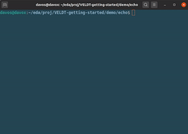

# Where Lions Roam: Haskell & Hardware on the VELDT

## Table of Contents
1. [Section 1: Introduction & Setup](https://github.com/standardsemiconductor/VELDT-getting-started#section-1-introduction--setup)
2. [Section 2: Fiat Lux](https://github.com/standardsemiconductor/VELDT-getting-started#section-2-fiat-lux)
   1. [Learning to Count](https://github.com/standardsemiconductor/VELDT-getting-started#learning-to-count)
   2. [Its a Vibe: PWM](https://github.com/standardsemiconductor/VELDT-getting-started#its-a-vibe-pwm)
   3. [Drive: RGB Primitive](https://github.com/standardsemiconductor/VELDT-getting-started#drive-rgb-primitive)
   4. [Fiat Lux: Blinker](https://github.com/standardsemiconductor/VELDT-getting-started#fiat-lux-blinker)
3. [Section 3: Roar](https://github.com/standardsemiconductor/VELDT-getting-started#section-3-roar)
   1. [Serial for Breakfast](https://github.com/standardsemiconductor/VELDT-getting-started#serial-for-breakfast)
   2. [UART My Art](https://github.com/standardsemiconductor/VELDT-getting-started#uart-my-art)
   3. [Roar: Echo](https://github.com/standardsemiconductor/VELDT-getting-started#roar-echo)
4. [Section 4: Happylife](https://github.com/standardsemiconductor/VELDT-getting-started#happylife)
   1. [DRY PWM](https://github.com/standardsemiconductor/VELDT-getting-started#dry-pwm)
   2. [Happylife: UART LED](https://github.com/standardsemiconductor/VELDT-getting-started#happylife-uart-led)
   
**Clicking on any header within this document will return to Table of Contents** 

## [Section 1: Introduction & Setup](https://github.com/standardsemiconductor/VELDT-getting-started#table-of-contents)

> The nursery was silent. It was empty as a jungle glade at hot high noon. The walls were blank and two dimensional. Now, as George and Lydia Hadley stood in the center of the room, the walls began to purrand recede into crystalline distance, it seemed, and presently an African veldt appeared, in three dimensions, on all sides, in color reproduced to the final pebble and bit of straw. The ceiling above them became a deep sky with a hot yellow sun.
> *The Veldt* by Ray Bradbury

This is an opinionated guide to hardware design from first principles using Haskell and VELDT.  We assume you are using the [VELDT FPGA development board](https://www.standardsemiconductor.com) available to order from [Amazon](https://www.amazon.com/dp/B08F9T8DFT?ref=myi_title_dp). We also assume you are using Linux, but this is only for getting the tools setup and running the examples. 
  
The code included in the examples is written in Haskell and compiled to Verilog using [Clash](https://clash-lang.org/). We find hardware design with Haskell to be an enriching experience, and if you are experimenting with HDLs or just starting out with hardware, give it a shot. As hardware designs scale so too does the language and the ability to abstractly compose machines which makes designing them a blast! Visit the [VELDT-info](https://github.com/standardsemiconductor/VELDT-info#clash) repo for instructions on installation and setup of Haskell and Clash tools.
  
We use the Project IceStorm flow for synthesis, routing, and programming. These are excellent, well-maintained open source tools. For installation and setup instructions visit the [VELDT-info](https://github.com/standardsemiconductor/VELDT-info#project-icestorm) repo.

This guide is split into several sections. Each section begins with construction of sub-components then culminates with an application which utilizes the sub-components. [Section 2](https://github.com/standardsemiconductor/VELDT-getting-started#section-2-fiat-lux) constructs a simple blinker, the "hello-world" of FPGAs. [Section 3](https://github.com/standardsemiconductor/VELDT-getting-started#section-3-roar) covers serializers and deserializers which are used to construct a UART. In the future we hope to add sections which demonstrate how to interact with the memory provided by VELDT, design a simple CPU with a custom ISA, and constuct a System-On-Chip (SoC).

By the end of the guide, you will have a library of commonly used sub-components along with a directory of applications demonstrating their usage. The library and demos explained in this guide are available in this repo, see the [veldt](https://github.com/standardsemiconductor/VELDT-getting-started/tree/master/veldt) and [demo](https://github.com/standardsemiconductor/VELDT-getting-started/tree/master/demo) directories.

Finally, if you have any suggestions, comments, discussions, edits additions etc. please open an issue in this repo. We value any and all contributions. Let's get started!

## [Section 2: Fiat Lux](https://github.com/standardsemiconductor/VELDT-getting-started#table-of-contents)
In this section we start by building a counter then, using the counter, construct a PWM. Equipped with our counter and PWM, we use the RGB LED Driver IP to create our first running application on VELDT; a blinker!

### [Learning to Count](https://github.com/standardsemiconductor/VELDT-getting-started#table-of-contents)
We begin by creating a directory called "veldt" to contain our haskell library:
```console
foo@bar:~/VELDT-getting-started$ mkdir veldt && cd veldt
```
We use the [clash-example-project](https://github.com/clash-lang/clash-compiler/tree/master/clash-starters/clash-example-project) as a template. Specifically, we copy the `bin/`, `cabal.project`, and `clash-example-project.cabal` into our `veldt` directory. We need to change the project name in the `cabal.project` and `veldt.cabal` files from `clash-example-project` to `veldt`. Additionally, in the `veldt.cabal` file we add `mtl`, `lens`, and `interpolate` to the build-depends section. 

Your `cabal.project` file should look similar:
```
packages:
  veldt.cabal

package clash-prelude
  -- 'large-tuples' generates tuple instances for various classes up to the
  -- GHC imposed maximum of 62 elements. This severely slows down compiling
  -- Clash, and triggers Template Haskell bugs on Windows. Hence, we disable
  -- it by default. This will be the default for Clash >=1.4.
  flags: -large-tuples
```

Your `veldt.cabal` file should look similar:
```
cabal-version:       2.4
name:                veldt
version:             0.1.0.0
license-file:        LICENSE
author:              Standard Semiconductor
maintainer:          standard.semiconductor@gmail.com
extra-source-files:  CHANGELOG.md

common common-options
  default-extensions:
    BangPatterns
    BinaryLiterals
    ConstraintKinds
    DataKinds
    DefaultSignatures
    DeriveAnyClass
    DeriveDataTypeable
    DeriveFoldable
    DeriveFunctor
    DeriveGeneric
    DeriveLift
    DeriveTraversable
    DerivingStrategies
    InstanceSigs
    KindSignatures
    LambdaCase
    NoStarIsType
    PolyKinds
    RankNTypes
    ScopedTypeVariables
    StandaloneDeriving
    TupleSections
    TypeApplications
    TypeFamilies
    TypeOperators
    ViewPatterns

    -- TemplateHaskell is used to support convenience functions such as
    -- 'listToVecTH' and 'bLit'.
    TemplateHaskell
    QuasiQuotes

    -- Prelude isn't imported by default as Clash offers Clash.Prelude
    NoImplicitPrelude
  ghc-options:
    -Wall -Wcompat

    -- Plugins to support type-level constraint solving on naturals
    -fplugin GHC.TypeLits.Extra.Solver
    -fplugin GHC.TypeLits.Normalise
    -fplugin GHC.TypeLits.KnownNat.Solver

    -- Clash needs access to the source code in compiled modules
    -fexpose-all-unfoldings

    -- Worker wrappers introduce unstable names for functions that might have
    -- blackboxes attached for them. You can disable this, but be sure to add
    -- a no-specialize pragma to every function with a blackbox.
    -fno-worker-wrapper
  default-language: Haskell2010
  build-depends:
    base,
    Cabal,
    mtl,
    lens,
    interpolate,
    
    -- clash-prelude will set suitable version bounds for the plugins
    clash-prelude >= 1.2.2 && < 1.4,
    ghc-typelits-natnormalise,
    ghc-typelits-extra,
    ghc-typelits-knownnat
                     
library
        import: common-options
        exposed-modules: Veldt.Counter
        default-language: Haskell2010
        
-- Builds the executable 'clash', with veldt in scope
executable clash
  main-is: bin/Clash.hs
  Build-Depends: base, clash-ghc, veldt
  if !os(Windows)
    ghc-options: -dynamic

-- Builds the executable 'clashi', with veldt in scope
executable clashi
  main-is: bin/Clashi.hs
  if !os(Windows)
    ghc-options: -dynamic
  build-depends: base, clash-ghc, veldt
```
We won't go through everything about this cabal file, but here are the highlights.

The common-section has three major parts:
  1. `default-extensions` extends the Haskell language, helps to reduce boilerplate, and cleans up syntax. `NoImplicitPrelude` is especially important, it says we don't want the standard Haskell prelude imported implicitly. Instead, we want to explicitly import the Clash prelude. More information about language extensions can be found in the [GHC users guide](https://downloads.haskell.org/~ghc/latest/docs/html/users_guide/glasgow_exts.html). 
  2. `ghc-options` turns on warnings and activates plugins.
  3. `build-depends` lists our library dependencies. We use monad transformers from `mtl` and `lens` to zoom and mutate substates. `interpolate` is used for inline primitives when we need Yosys to infer hardware IP. `base` provides standard haskell functions and types. The `ghc-typelits...` packages are plugins to help the Clash compiler infer and manipulate types.

In the library section we import the `common-options` and list `exposed-modules` which are the modules we export from the library to be used in our demos. So far we see `Veldt.Counter`, we will create a directory `Veldt` with a file `Counter.hs`. This will have our counter source code.

The last two parts define executables `clash` and `clashi` which we use to invoke the Clash compiler.

Create a directory `Veldt` with a file `Counter.hs`.
```console
foo@bar:~/VELDT-getting-started/veldt$ mkdir Veldt && cd Veldt
foo@bar:~/VELDT-getting-started/veldt/Veldt$ touch Counter.hs
```

Open `Counter.hs` in your favorite editor. Let's name the module, list the exports and import some useful packages:
```haskell
module Veldt.Counter
  ( increment
  , incrementWhen
  , incrementUnless
  , decrement
  ) where

import Clash.Prelude
```
The exported functions define the API for a counter. We want to be able to `increment` and `decrement` the counter. Additionally, we provide conditional increment functions `incrementWhen` and `incrementUnless`. Often when designing a new module, you won't know beforehand what the "right" API should look like. That's OK, start by writing what you think it should look like, then refactor as needed. The APIs shown throughout this guide were "found" over many months of rewrites and refactoring as the modules were used and combined in different ways. Even after many months, the APIs still change and the modules become more robust over time. Haskell makes it easy to refactor without fear, just let the types guide you; the compiler is your friend!

The `increment` function returns the successor of the argument while also wrapping around the maximum bound. If the argument is equal to `maxBound` then return `minBound`; effectively wrapping around the bound. Otherwise, return the successor of the argument using `succ`. The `decrement` function is similar, except the function respects `minBound` and returns the predecessor using `pred`.
```haskell
increment :: (Bounded a, Enum a, Eq a) => a -> a
increment a
  | a == maxBound = minBound
  | otherwise = succ a

decrement :: (Bounded a, Enum a, Eq a) => a -> a
decrement a 
  | a == minBound = maxBound
  | otherwise = pred a
```
Note, the `increment` and `decrement` functions have typeclass constraints `(Bounded a, Enum a, Eq a)`. The compiler will make sure the argument `a` is an instance of `Bounded`, `Enum`, and `Eq`. The typeclass constraint [`Bounded`](http://hackage.haskell.org/package/clash-prelude-1.2.4/docs/Clash-HaskellPrelude.html#t:Bounded) says our counter has a minimum and maximum value which gives us `minBound` and `maxBound`. Likewise [`Eq`](http://hackage.haskell.org/package/clash-prelude-1.2.4/docs/Clash-HaskellPrelude.html#t:Eq) lets us compare equality `==` and [`Enum`](http://hackage.haskell.org/package/clash-prelude-1.2.4/docs/Clash-HaskellPrelude.html#t:Enum) provides `succ` (successor) and `pred` (predecessor) functions on our polymorphic type `a`. Without these constraints the compiler would complain that it could not deduce the required typeclass. 

When designing your own counter functions be careful when using `succ` or `pred`. For example `succ 0 == (1 :: BitVector 8)` and `pred 4 == (3 :: Index 6)`, but `succ (4 :: Index 5)` is undefined and out of bounds because the type `Index 5` only has inhabitants `0`,`1`,`2`,`3`, and `4`; that is why we check for `maxBound` and `minBound` states in `increment` and `decrement`.

Finally, we use our new `increment` function to implement a conditional increment `incrementWhen` and `incrementUnless`. The former will increment when a predicate is `True`, the latter when `False`.
```haskell
incrementWhen :: (Bounded a, Enum a, Eq a) => (a -> Bool) -> a -> a
incrementWhen p a
  | p a = increment a
  | otherwise = minBound

incrementUnless :: (Bounded a, Enum a, Eq a) => (a -> Bool) -> a -> a
incrementUnless p = incrementWhen (not . p)
```
Within `incrementWhen`, we apply our predicate argument `p` to the counter argument `a`. If the predicate evaluates to `True`, we return the incremented the counter value. Otherwise, return the minimum bound. To reduce and reuse code, we implement `incrementUnless` using `incrementWhen` and post-compose `not` to our predicate. Suppose we have `incrementUnless (== 3) :: Index 8 -> Index 8`, then the counter would be incremented if it does NOT equal 3. However, if the counter does equal 3, then the returned value is 0.

Here is our completed counter:
```haskell
module Veldt.Counter
  ( increment
  , incrementWhen
  , incrementUnless
  , decrement
  ) where

import Clash.Prelude

-------------
-- Counter --
-------------
increment :: (Bounded a, Enum a, Eq a) => a -> a
increment a
  | a == maxBound = minBound
  | otherwise = succ a          

decrement :: (Bounded a, Enum a, Eq a) => a -> a
decrement a
  | a == minBound = maxBound
  | otherwise = pred a

incrementWhen :: (Bounded a, Enum a, Eq a) => (a -> Bool) -> a -> a
incrementWhen p a
  | p a = increment a
  | otherwise = minBound

incrementUnless :: (Bounded a, Enum a, Eq a) => (a -> Bool) -> a -> a
incrementUnless p = incrementWhen (not . p)
```
To end this part, we clean and rebuild the library. You should not see any errors.
```console
foo@bar:~/VELDT-getting-started/veldt$ cabal clean
foo@bar:~/VELDT-getting-started/veldt$ cabal build
...
[1 of 1] Compiling Veldt.Counter    ...
```
You can find the full counter source code [here](https://github.com/standardsemiconductor/VELDT-getting-started/blob/master/veldt/Veldt/Counter.hs). We can now use our counter API to create a PWM.

### [Its a Vibe: PWM](https://github.com/standardsemiconductor/VELDT-getting-started#table-of-contents)
Pulse Width Modulation or PWM is used to drive our LED. We use a technique called [time proportioning](https://en.wikipedia.org/wiki/Pulse-width_modulation#Time_proportioning) to generate the PWM signal with our counter. To begin let's create a `PWM.hs` file in the `Veldt` directory.
```console
foo@bar:~/VELDT-getting-started/veldt/Veldt$ touch PWM.hs
```
We also need to expose the PWM module with cabal by editing the `exposed-modules` section of `veldt.cabal` to include `Veldt.PWM`.
```
......
library
	...
        exposed-modules: Veldt.Counter,
	                 Veldt.PWM
	...
......
```
Now begin editing the `PWM.hs` file. We start by naming the module, defining our exports, and importing useful packages.
```haskell
module Veldt.PWM
  ( PWM
  , mkPWM
  , pwm
  , setDuty
  ) where

import Clash.Prelude
import Control.Lens
import Control.Monad.RWS
import Veldt.Counter
```
We export the type `PWM` and its smart constructor `mkPWM`. The monadic API consists of `pwm`, a PWM action, and a setter `setDuty` to mutate the duty cycle. In this module we will be using [lens](https://hackage.haskell.org/package/lens) to set, modify, and get sub-states. We usethe RWS monad from [mtl](https://hackage.haskell.org/package/mtl) because it allows zooming, magnification, and scribing. Although zooming etc. is not used in this module, it will help composition in the future as our library grows. Finally we import our counter module.

Next we define the `PWM` type and its constructor. Note how we use `makeLenses` to automatically create lenses for our `PWM` type.
```haskell
data PWM a = PWM
  { _ctr  :: a
  , _duty :: a
  } deriving (NFDataX, Generic)
makeLenses ''PWM

mkPWM :: Bounded a => a -> PWM a
mkPWM = PWM minBound
```
The PWM state consists of a counter and a value used to control the duty cycle. Also, note that we keep `PWM` polymorphic. Our smart constructor `mkPWM` takes an initial duty cycle and creates a PWM with a counter initially set to the minimum bound. 

Let's define and implement `setDuty` which will update the `duty` cycle and reset the counter.
```haskell
setDuty :: (Monoid w, Monad m, Bounded a) => a -> RWST r w (PWM a) m ()
setDuty d = do
  duty .= d
  ctr .= minBound
```
We use the [`.=`](https://hackage.haskell.org/package/lens-4.19.2/docs/Control-Lens-Operators.html#v:.-61-) lens operator to set the `duty` cycle and reset the `ctr` to `minBound`. We use `setDuty` to change the duty cycle of the PWM. For example, suppose we have `setDuty 25 :: RWST r w (PWM (Index 100)) m ()`, then the PWM will operate at 25% duty cycle.

Finally, we tackle the `pwm` function.
```haskell
pwm :: (Monoid w, Monad m, Ord a, Bounded a, Enum a) => RWST r w (PWM a) m Bit
pwm = do
  d <- use duty
  c <- ctr <<%= increment
  return $ boolToBit $ c < d
```
First we bind `duty` to `d`. Next we `increment` the `ctr` and bind it's **old** value to `c` with [`<<%=`](https://hackage.haskell.org/package/lens-4.19.2/docs/Control-Lens-Lens.html#v:-60--60--37--61-). Last, we compare `c < d`, convert the [`boolToBit`](https://hackage.haskell.org/package/clash-prelude-1.2.5/docs/Clash-Class-BitPack.html#v:boolToBit), and `return` the bit. `boolToBit` simply maps `True` to `1 :: Bit` and `False` to `0 :: Bit`. Because we compare the `duty` `d` to the counter `c` with `<`, our type signature requires the underlying counter type `a` to be a member of the `Ord` typeclass. For example, if we have `pwm :: RWST r w (PWM (Index 4)) m Bit` and `duty` is bound to `3 :: Index 4`, (75% duty cycle, remember `Index 4` has inhabitants 0, 1, 2, 3), the output of `pwm` when run as a mealy machine would be: ... 1, 1, 1, 0, 1, 1, 1, 0, ... .

Here is the complete `PWM.hs` source code:
```haskell
module Veldt.PWM
  ( PWM
  , mkPWM
  , pwm
  , setDuty
  ) where

import Clash.Prelude
import Control.Lens
import Control.Monad.RWS
import Veldt.Counter

---------
-- PWM --
---------
data PWM a = PWM
  { _ctr  :: a
  , _duty :: a
  } deriving (NFDataX, Generic)
makeLenses ''PWM

mkPWM :: Bounded a => a -> PWM a
mkPWM = PWM minBound

setDuty :: (Monoid w, Monad m, Bounded a) => a -> RWST r w (PWM a) m ()
setDuty d = do
  duty .= d
  ctr .= minBound

pwm :: (Monoid w, Monad m, Ord a, Bounded a, Enum a) => RWST r w (PWM a) m Bit
pwm = do
  d <- use duty
  c <- ctr <<%= increment
  return $ boolToBit $ c < d
```
To end this part, we rebuild the library. You should not see any errors.
```console
foo@bar:~/VELDT-getting-started/veldt$ cabal build
...
[1 of 2] Compiling Veldt.Counter ...
[2 of 2] Compiling Veldt.PWM     ...
```
You can find the full PWM source code [here](https://github.com/standardsemiconductor/VELDT-getting-started/blob/master/veldt/Veldt/PWM.hs). In the next part, we use a Clash primitive to infer Lattice RGB Driver IP.

### [Drive: RGB Primitive](https://github.com/standardsemiconductor/VELDT-getting-started#table-of-contents)
We need one more component before starting our demo, a RGB (Red, Green, Blue) LED Driver. It takes 3 PWM signals (R, G, B) to drive the LED. We use the Verilog template from the Lattice documentation [iCE40 LED Driver Usage Guide](https://github.com/standardsemiconductor/VELDT-info/blob/master/ICE40LEDDriverUsageGuide.pdf). Because the RGB Driver is a Lattice IP block, we need our compiled Haskell code to take a certain form in Verilog. When we synthesize the demo, Yosys will infer the Lattice Ice40 RGB Driver IP (SB_RGBA_DRV) from the Verilog code. In order to have Clash use a certain Verilog (or VHDL) code, we write a primitive. This primitive tells the Clash compiler to insert Verilog (or VHDL) instead of compiling our function. Let's begin by creating a directory `Ice40` for our Lattice primitives. This will be within the `Veldt` directory. Then we create a `Rgb.hs` file which will be our RGB Driver primitive.
```console
foo@bar:~/VELDT-getting-started/veldt$ mkdir Veldt/Ice40 && touch Veldt/Ice40/Rgb.hs
```
Next add the `Veldt.Ice40.Rgb` to our `veldt.cabal` `exposed-modules` list.
```
...
exposed-modules: Veldt.Counter,
                 Veldt.PWM,
                 Veldt.Ice40.Rgb
...
```
Now edit `Rgb.hs`. We inline the Verilog primitive (meaning we have Verilog and Haskell in the same module), and then wrap it with a function to ease usage. Let's start by naming the module, its exports, and its imports.
```haskell
module Veldt.Ice40.Rgb
  ( Rgb
  , rgbDriver
  ) where

import Clash.Prelude
import Clash.Annotations.Primitive
import Data.String.Interpolate (i)
import Data.String.Interpolate.Util (unindent)
```
We export the `Rgb` type which is the input/output type of our primitive and a wrapper function `rgbDriver` for the primitive. Additionally we import `Clash.Annotations.Primitive` which supplies code for writing primitives. Since the primtive will be inlined we use the [interpolate](https://hackage.haskell.org/package/interpolate) package for string interpolation.

Now we create the primitive.
```haskell
{-# ANN rgbPrim (InlinePrimitive [Verilog] $ unindent [i|
  [ { "BlackBox" :
      { "name" : "Veldt.Ice40.Rgb.rgbPrim"
      , "kind" : "Declaration"
      , "type" :
  "rgbPrim
  :: String         -- current_mode ARG[0]
  -> String         -- rgb0_current ARG[1]
  -> String         -- rgb1_current ARG[2]
  -> String         -- rgb2_current ARG[3]
  -> Signal dom Bit -- pwm_r        ARG[4]
  -> Signal dom Bit -- pwm_g        ARG[5]
  -> Signal dom Bit -- pwm_b        ARG[6]
  -> Signal dom (Bit, Bit, Bit)"
      , "template" :
  "//SB_RGBA_DRV begin
  wire ~GENSYM[RED][0];
  wire ~GENSYM[GREEN][1];
  wire ~GENSYM[BLUE][2];

  SB_RGBA_DRV #(
     .CURRENT_MODE(~ARG[0]),
     .RGB0_CURRENT(~ARG[1]),
     .RGB1_CURRENT(~ARG[2]),
     .RGB2_CURRENT(~ARG[3])
  ) RGBA_DRIVER (
     .CURREN(1'b1),
     .RGBLEDEN(1'b1),
     .RGB0PWM(~ARG[4]),
     .RGB1PWM(~ARG[5]),
     .RGB2PWM(~ARG[6]),
     .RGB0(~SYM[0]),
     .RGB1(~SYM[1]),
     .RGB2(~SYM[2])
  );
 
  assign ~RESULT = {~SYM[0], ~SYM[1], ~SYM[2]};
  //SB_RGBA_DRV end"
      }
    } 
  ]
  |]) #-}
```
When writing primitives be sure the function name, module name, and black box name all match. The template is Verilog from the Lattice documentation [iCE40 LED Driver Usage Guide](https://github.com/standardsemiconductor/VELDT-info/blob/master/ICE40LEDDriverUsageGuide.pdf). The documentation for writing primitives is on the [clash-prelude](https://hackage.haskell.org/package/clash-prelude) hackage page in the `Clash.Annotations.Primitive` module. Basically, the `SB_RGBA_DRV` module takes 3 PWM input signals and outputs 3 LED driver signals. We adopt the style to prefix any primitive functions with `Prim`. Let's give a Haskell function stub for the primitive.
```haskell
{-# NOINLINE rgbDriverPrim #-}
rgbPrim
  :: String
  -> String
  -> String
  -> String
  -> Signal dom Bit
  -> Signal dom Bit
  -> Signal dom Bit
  -> Signal dom (Bit, Bit, Bit)
rgbPrim !_ !_ !_ !_ !_ !_ !_ = pure (0, 0, 0)
```
Although we do not provide a real implementation for the the primitive in Haskell, it is good practice to do so and helps when testing and modeling. We use [bang patterns](https://downloads.haskell.org/~ghc/latest/docs/html/users_guide/glasgow_exts.html#bang-patterns-and-strict-haskell) on the arguments to ensure our primitive is strictly evaluated. Also, note the type of `rgbPrim` matches exactly to the inlined primitive type and has a `NOINLINE` annotation.

Instead of constantly writing `(Bit, Bit, Bit)` for our RGB tuple, let's define a type synonym with some tags which are useful when constraining pins.
```haskell
type Rgb = ("red" ::: Bit, "green" ::: Bit, "blue" ::: Bit)
```
Finally, using our `Rgb` type, we wrap the primitive and give it some default parameters.
```haskell
rgb :: Signal dom Rgb -> Signal dom Rgb
rgb rgbPWM = let (r, g, b) = unbundle rgbPWM
             in rgbPrim "0b0" "0b111111" "0b111111" "0b111111" r g b
```
`unbundle` is part of a `Signal` isomorphism, the other part being `bundle`. In this case, `unbundle` maps the type `Signal dom (Bit, Bit, Bit)` to `(Signal dom Bit, Signal dom Bit, Signal dom Bit)`. The `String` parameters we give to `rgbPrim` define the current and mode outputs for the driver. It may be prudent to adjust these parameters depending on the power requirements of your application. It is a good exercise to define a custom current/mode data type and use that in the wrapper `rgb` for easy usage.

Here is the complete `Rgb.hs` source code:
```haskell
module Veldt.Ice40.Rgb
  ( Rgb
  , rgb
  ) where

import Clash.Prelude
import Clash.Annotations.Primitive
import Data.String.Interpolate (i)
import Data.String.Interpolate.Util (unindent)

{-# ANN rgbPrim (InlinePrimitive [Verilog] $ unindent [i|
  [ { "BlackBox" :
      { "name" : "Veldt.Ice40.Rgb.rgbPrim"
      , "kind" : "Declaration"
      , "type" :
  "rgbPrim
  :: String         -- current_mode ARG[0]
  -> String         -- rgb0_current ARG[1]
  -> String         -- rgb1_current ARG[2]
  -> String         -- rgb2_current ARG[3]
  -> Signal dom Bit -- pwm_r        ARG[4]
  -> Signal dom Bit -- pwm_g        ARG[5]
  -> Signal dom Bit -- pwm_b        ARG[6]
  -> Signal dom (Bit, Bit, Bit)"
      , "template" :
  "//SB_RGBA_DRV begin
  wire ~GENSYM[RED][0];
  wire ~GENSYM[GREEN][1];
  wire ~GENSYM[BLUE][2];

  SB_RGBA_DRV #(
     .CURRENT_MODE(~ARG[0]),
     .RGB0_CURRENT(~ARG[1]),
     .RGB1_CURRENT(~ARG[2]),
     .RGB2_CURRENT(~ARG[3])
  ) RGBA_DRIVER (
     .CURREN(1'b1),
     .RGBLEDEN(1'b1),
     .RGB0PWM(~ARG[4]),
     .RGB1PWM(~ARG[5]),
     .RGB2PWM(~ARG[6]),
     .RGB0(~SYM[0]),
     .RGB1(~SYM[1]),
     .RGB2(~SYM[2])
  );
 
  assign ~RESULT = {~SYM[0], ~SYM[1], ~SYM[2]};
  //SB_RGBA_DRV end"
      }
    } 
  ]
  |]) #-}

{-# NOINLINE rgbPrim #-}
rgbPrim
  :: String
  -> String
  -> String
  -> String
  -> Signal dom Bit
  -> Signal dom Bit
  -> Signal dom Bit
  -> Signal dom (Bit, Bit, Bit)
rgbPrim !_ !_ !_ !_ !_ !_ !_ = pure (0, 0, 0)

type Rgb = ("red" ::: Bit, "green" ::: Bit, "blue" ::: Bit)

rgb :: Signal dom Rgb -> Signal dom Rgb
rgb rgbPWM = let (r, g, b) = unbundle rgbPWM
             in rgbPrim "0b0" "0b111111" "0b111111" "0b111111" r g b
```

To end this part, we rebuild the library. You should not see any errors.
```console
foo@bar:~/VELDT-getting-started/veldt$ cabal build
Building library for veldt-0.1.0.0..
[1 of 3] Compiling Veldt.Counter    ...
[2 of 3] Compiling Veldt.Ice40.Rgb  ...
[3 of 3] Compiling Veldt.PWM        ...
```
You can find the full RGB Driver source code [here](https://github.com/standardsemiconductor/VELDT-getting-started/blob/master/veldt/Veldt/Ice40/Rgb.hs). We now move onto creating a blinker.

### [Fiat Lux: Blinker](https://github.com/standardsemiconductor/VELDT-getting-started#table-of-contents)
This is our first demo, we will use our PWM to blink an LED; it will light up red, green, blue, then cycle back to red. Let's begin by setting up a directory for our demos, then setup a blinker demo with cabal:
```console
foo@bar:~/VELDT-getting-started$ mkdir -p demo/blinker && cd demo/blinker
```
Once again, we use [clash-example-project](https://github.com/clash-lang/clash-compiler/tree/master/clash-starters/clash-example-project) as our starting template. Copy the `/bin` directory, `cabal.project`, and `clash-example-project.cabal`. Be sure to update the project name and dependencies.

Your `cabal.project` file should look similar, note we also include the `veldt.cabal` file from our library; you may need to change the filepath to `veldt.cabal` depending on your file locations:
```
packages:
  blinker.cabal,
  ../../veldt/veldt.cabal

package clash-prelude
  -- 'large-tuples' generates tuple instances for various classes up to the
  -- GHC imposed maximum of 62 elements. This severely slows down compiling
  -- Clash, and triggers Template Haskell bugs on Windows. Hence, we disable
  -- it by default. This will be the default for Clash >=1.4.
  flags: -large-tuples
```
Your `blinker.cabal` file should look similar:
```
cabal-version:       2.4
name:                blinker
version:             0.1.0.0
license-file:        LICENSE
author:              Standard Semiconductor
maintainer:          standard.semiconductor@gmail.com
extra-source-files:  CHANGELOG.md

common common-options
  default-extensions:
    BangPatterns
    BinaryLiterals
    ConstraintKinds
    DataKinds
    DefaultSignatures
    DeriveAnyClass
    DeriveDataTypeable
    DeriveFoldable
    DeriveFunctor
    DeriveGeneric
    DeriveLift
    DeriveTraversable
    DerivingStrategies
    InstanceSigs
    KindSignatures
    LambdaCase
    NoStarIsType
    PolyKinds
    RankNTypes
    ScopedTypeVariables
    StandaloneDeriving
    TupleSections
    TypeApplications
    TypeFamilies
    TypeOperators
    ViewPatterns

    -- TemplateHaskell is used to support convenience functions such as
    -- 'listToVecTH' and 'bLit'.
    TemplateHaskell
    QuasiQuotes

    -- Prelude isn't imported by default as Clash offers Clash.Prelude
    NoImplicitPrelude
  ghc-options:
    -Wall -Wcompat

    -- Plugins to support type-level constraint solving on naturals
    -fplugin GHC.TypeLits.Extra.Solver
    -fplugin GHC.TypeLits.Normalise
    -fplugin GHC.TypeLits.KnownNat.Solver

    -- Clash needs access to the source code in compiled modules
    -fexpose-all-unfoldings

    -- Worker wrappers introduce unstable names for functions that might have
    -- blackboxes attached for them. You can disable this, but be sure to add
    -- a no-specialize pragma to every function with a blackbox.
    -fno-worker-wrapper
  default-language: Haskell2010
  build-depends:
    base,
    Cabal,
    mtl,
    lens,
    interpolate,
    veldt,
    
    -- clash-prelude will set suitable version bounds for the plugins
    clash-prelude >= 1.2.2 && < 1.4,
    ghc-typelits-natnormalise,
    ghc-typelits-extra,
    ghc-typelits-knownnat
                     
library
        import: common-options
        exposed-modules: Blinker
        default-language: Haskell2010

-- Builds the executable 'clash', with blinker in scope
executable clash
  main-is: bin/Clash.hs
  Build-Depends: base, clash-ghc, blinker
  if !os(Windows)
    ghc-options: -dynamic

-- Builds the executable 'clashi', with blinker in scope
executable clashi
  main-is: bin/Clashi.hs
  if !os(Windows)
    ghc-options: -dynamic
  build-depends: base, clash-ghc, blinker
```

With that out of the way, let's create a `Blinker.hs` file and open the file with a text editor.
```console
foo@bar:~/VELDT-getting-started/demo/blinker$ touch Blinker.hs
```

We start by naming our module and importing dependencies.
```haskell
module Blinker where

import Clash.Prelude
import Clash.Annotations.TH
import Control.Monad.RWS
import Control.Lens hiding (Index)
import qualified Veldt.Counter   as C
import qualified Veldt.PWM       as P
import qualified Veldt.Ice40.Rgb as R
```
Using qualified imports can help to reduce ambiguity and expedite the process of looking up type signatures. `Clash.Annotations.TH` includes functions to name the top entity module which is used for synthesis. Both `Clash.Prelude` and `Control.Lens` export an `Index` type. In order to use the prelude `Index`, we skip importing it from `Control.Lens` with the `hiding` keyword. The [Haskell wiki](https://wiki.haskell.org/Import) has more information concerning imports. 

Let's define some types to get a feel for the state space.
```haskell
type Byte = BitVector 8

data Color = Red | Green | Blue
  deriving (NFDataX, Generic, Show, Eq, Enum, Bounded)

data Blinker = Blinker
  { _color    :: Color
  , _redPWM   :: P.PWM Byte
  , _greenPWM :: P.PWM Byte
  , _bluePWM  :: P.PWM Byte
  , _timer    :: Index 24000000
  } deriving (NFDataX, Generic)
makeLenses ''Blinker

mkBlinker :: Blinker
mkBlinker = Blinker
  { _color    = Red
  , _redPWM   = P.mkPWM 0xFF
  , _greenPWM = P.mkPWM 0
  , _bluePWM  = P.mkPWM 0
  , _timer    = 0
  } 
```
The blinker needs a color counter, three PWMs (one to drive each RGB signal), and a timer which will indicate when the color should change. We also create the `mkBlinker` smart constructor which initializes the color to `Red` and sets the red PWM duty cycle to `0xFF` with the other PWM duty cycles to `0` and the timer to `0`. We derive `Eq`, `Bounded` and `Enum` (along with the usual `NFDataX` and `Generic`) for `Color` so we can use functions from `Veldt.Counter`. For example, if we want to change the color from Red to Green, we can use `increment`. Remember `increment` also respects bounds, so incrementing the color `Blue` just wraps back around to `Red`.

Next, we create a `toPWM` function to convert a `Color` into its RGB triple which we use to set the PWM duty cycles.
```haskell
toPWM :: Color -> (Byte, Byte, Byte)
toPWM Red   = (0xFF, 0,    0   )
toPWM Green = (0,    0xFF, 0   )
toPWM Blue  = (0,    0,    0xFF)
```
The next function `blinkerM` is the core of our demo. Here is the implementation.
```haskell
blinkerM :: RWS r () Blinker R.Rgb
blinkerM = do
  r <- zoom redPWM   P.pwm
  g <- zoom greenPWM P.pwm
  b <- zoom bluePWM  P.pwm
  timerDone <- uses timer (== maxBound)
  timer %= C.increment
  when timerDone $ do
    c' <- color <%= C.increment
    let (redDuty', greenDuty', blueDuty') = toPWM c'
    zoom redPWM   $ P.setDuty redDuty'
    zoom greenPWM $ P.setDuty greenDuty'
    zoom bluePWM  $ P.setDuty blueDuty'
  return (r, g, b)
```
First we run each PWM with `pwm` and bind the output `Bit` to `r`, `g`, and `b`. [`zoom`](https://hackage.haskell.org/package/lens-4.19.2/docs/Control-Lens-Combinators.html#v:zoom) allows us to run a monadic action within larger state. Next, we get the current timer value and check if it equals `maxBound` with [`uses`](https://hackage.haskell.org/package/lens-4.19.2/docs/Control-Lens-Combinators.html#v:uses) then bind the resulting `Bool` to `timerDone`. The clock has a frequency of 12Mhz and the timer increments every cycle therefore counting from 0 to 23,999,999 takes two seconds. Having checked the timer, we `increment` it; remember that `increment` respects bounds. When `timerDone` is `True`, we `increment` the `color` and bind the new color to `c'` with [`<%=`](https://hackage.haskell.org/package/lens-4.19.2/docs/Control-Lens-Lens.html#v:-60--37--61-). Next we apply `toPWM` and bind the updated duty cycles. Then, we update each PWM duty cycle using `setDuty`. Finally, we `return` the PWM outputs `r`, `g`, and `b` which were bound at the start of `blinkerM`. 

Now we need to run `blinkerM` as a mealy machine. This requires the use of [`mealy`](http://hackage.haskell.org/package/clash-prelude-1.2.4/docs/Clash-Prelude.html#v:mealy) from the Clash Prelude. [`mealy`](http://hackage.haskell.org/package/clash-prelude-1.2.4/docs/Clash-Prelude.html#v:mealy) takes a transfer function of type `s -> i -> (s, o)` and an initial state then produces a function of type `HiddenClockResetEnable dom => Signal dom i -> Signal dom o`.
```haskell
blinker :: HiddenClockResetEnable dom => Signal dom R.Rgb
blinker = R.rgb $ mealy blinkerMealy mkBlinker $ pure ()
  where
    blinkerMealy s i = let (a, s', ()) = runRWS blinkerM i s
		       in (s', a)
```
First, we transform our `blinkerM :: RWS r () Blinker R.Rgb` into a transfer function `blinkerMealy` with type `Blinker -> () -> (Blinker, R.Rgb)` using `runRWS`. We use the unit `()` to describe no input. Then we use `mkBlinker` to construct the initial state. Finally, we apply a unit signal as input and apply the mealy output directly to the RGB Driver IP.

Finally, we define the `topEntity` function which takes a clock as input and outputs a `Signal` of RGB LED driver.
```haskell
{-# NOINLINE topEntity #-}
topEntity
  :: "clk" ::: Clock XilinxSystem
  -> "led" ::: Signal XilinxSystem R.Rgb
topEntity clk = withClockResetEnable clk rst enableGen blinker
  where
    rst = unsafeFromHighPolarity $ pure False
makeTopEntityWithName 'topEntity "Blinker"
```
Note, every top entity function has the `NOINLINE` annotation. Although this is a Lattice FPGA, it just so happens that the `XilinxSystem` domain also works. Domains describe things such as reset polarity and clock period and active edge. More information about domains is found in the `Clash.Signal` module. `XilinxSystem` specifies active-high resets, therefore we define a `rst` signal, which is always inactive, by inputting `False` to [`unsafeFromHighPolarity`](http://hackage.haskell.org/package/clash-prelude-1.2.4/docs/Clash-Signal.html#v:withClockResetEnable).

`blinker` has a `HiddenClockResetEnable` constraint so we use [`withClockResetEnable`](http://hackage.haskell.org/package/clash-prelude-1.2.4/docs/Clash-Signal.html#v:withClockResetEnable) to expose the clock, reset, and enable signals.

We use the template haskell function [`makeTopEntityWithName`](http://hackage.haskell.org/package/clash-prelude-1.2.4/docs/Clash-Annotations-TH.html#v:makeTopEntityWithName) which will generate synthesis boilerplate and name the top module and its ports in Verilog. The inputs and outputs of the `topEntity` function will be constrained by the `Blinker.pcf`, or pin constraint file.

Here is the complete `Blinker.hs` source code:
```haskell
module Blinker where

import Clash.Prelude
import Clash.Annotations.TH
import Control.Monad.RWS
import Control.Lens hiding (Index)
import qualified Veldt.Counter   as C
import qualified Veldt.PWM       as P
import qualified Veldt.Ice40.Rgb as R

type Byte = BitVector 8

data Color = Red | Green | Blue
  deriving (NFDataX, Generic, Show, Eq, Enum, Bounded)

data Blinker = Blinker
  { _color    :: Color
  , _redPWM   :: P.PWM Byte
  , _greenPWM :: P.PWM Byte
  , _bluePWM  :: P.PWM Byte
  , _timer    :: Index 24000000
  } deriving (NFDataX, Generic)
makeLenses ''Blinker

mkBlinker :: Blinker
mkBlinker = Blinker
  { _color    = Red
  , _redPWM   = P.mkPWM 0xFF
  , _greenPWM = P.mkPWM 0
  , _bluePWM  = P.mkPWM 0
  , _timer    = 0
  }

toPWM :: Color -> (Byte, Byte, Byte)
toPWM Red   = (0xFF, 0,    0   )
toPWM Green = (0,    0xFF, 0   )
toPWM Blue  = (0,    0,    0xFF)

blinkerM :: RWS r () Blinker R.Rgb
blinkerM = do
  r <- zoom redPWM   P.pwm
  g <- zoom greenPWM P.pwm
  b <- zoom bluePWM  P.pwm
  timerDone <- uses timer (== maxBound)
  timer %= C.increment
  when timerDone $ do
    c' <- color <%= C.increment
    let (redDuty', greenDuty', blueDuty') = toPWM c'
    zoom redPWM   $ P.setDuty redDuty'
    zoom greenPWM $ P.setDuty greenDuty'
    zoom bluePWM  $ P.setDuty blueDuty'
  return (r, g, b)

blinker :: HiddenClockResetEnable dom => Signal dom R.Rgb
blinker = R.rgb $ mealy blinkerMealy mkBlinker $ pure ()
  where
    blinkerMealy s i = let (a, s', ()) = runRWS blinkerM i s
                       in (s', a)

{-# NOINLINE topEntity #-}
topEntity
  :: "clk" ::: Clock XilinxSystem
  -> "led" ::: Signal XilinxSystem R.Rgb
topEntity clk = withClockResetEnable clk rst enableGen blinker
  where
    rst = unsafeFromHighPolarity $ pure False
makeTopEntityWithName 'topEntity "Blinker"  
```

We need a `.pcf` file to connect the FPGA ports to our design ports. Keep in mind that `Rgb` is annotated with `red`, `green`, and `blue`. Thus, our only input is `clk`, and our three outputs are `led_red`, `led_green`, `led_blue`. Here is the [Blinker.pcf](https://github.com/standardsemiconductor/VELDT-getting-started/blob/master/demo/blinker/Blinker.pcf).
```
set_io clk 35 # iot_46b_g0 12Mhz Xtal

set_io led_blue  41 # rgb2 blue
set_io led_green 40 # rgb1 green
set_io led_red   39 # rgb0 red
```
The `#` indicates anything after it is a comment. We provide a [default pin constraint file](https://github.com/standardsemiconductor/VELDT-getting-started/blob/master/demo/pcf_generic.pcf) with helpful comments in the [demo](https://github.com/standardsemiconductor/VELDT-getting-started/tree/master/demo) directory; just remove the first `#` and change the pin name to suit your design.

Finally, we provide a [Makefile](https://github.com/standardsemiconductor/VELDT-getting-started/blob/master/demo/blinker/Makefile) along with a [generic version](https://github.com/standardsemiconductor/VELDT-getting-started/blob/master/demo/Makefile_generic) in the [demo](https://github.com/standardsemiconductor/VELDT-getting-started/tree/master/demo) directory. This automates building the Haskell code with cabal, compiling with Clash, synthesizing with Yosys, place-and-route with NextPNR, bitstream packing with icepack, and bitstream programming with iceprog. Specifically, `make build` just calls `cabal build`, `make` will build with cabal, synthesize, and place-and-route. `make prog` will program the bitstream to VELDT. `make clean` cleans synthesis files while `make clean-all` will also clean the cabal build cache. Information about automatic variables such as `$<` and `$@` can be found [here](https://www.gnu.org/software/make/manual/html_node/Automatic-Variables.html). Be sure `TOP` is assigned the same value as provided to `makeTopEntityWithName`.
```make
TOP := Blinker

all: $(TOP).bin

$(TOP).bin: $(TOP).asc
	icepack $< $@

$(TOP).asc: $(TOP).json $(TOP).pcf 
	nextpnr-ice40 --up5k --package sg48 --pcf $(TOP).pcf --asc $@ --json $<

$(TOP).json: $(TOP).hs
	cabal run clash --write-ghc-environment-files=always -- $(TOP) --verilog
	yosys -q -p "synth_ice40 -top $(TOP) -json $@ -abc2" verilog/$(TOP)/$(TOP)/*.v

prog: $(TOP).bin
	iceprog $<

build: $(TOP).hs
	cabal build $<

clean:
	rm -rf verilog/
	rm -f $(TOP).json
	rm -f $(TOP).asc
	rm -f $(TOP).bin
	rm -f *~
	rm -f *.hi
	rm -f *.o
	rm -f *.dyn_hi
	rm -f *.dyn_o

clean-all:
	$(MAKE) clean
	cabal clean

.PHONY: all clean clean-all prog build
```

To end this section, we build, synthesize, place-and-route, pack, and program VELDT. There should be no build errors. Verify your device utilisation looks similar, including usage of SB_RGBA_DRV.

Before programming, make sure VELDT is connected to your computer, the power switch is ON, and the mode switch is set to FLASH. After programming, make sure the LED blinks with the correct color order with the intended 2 second period. If the CDONE LED is not illuminated blue, try pressing the reset button and/or toggling the power switch. If you have any issues, questions, or suggestions please open a public issue in this repository or contact us privately at standard.semiconductor@gmail.com.
```console
foo@bar:~/VELDT-getting-started/demo/blinker$ make clean-all && make prog
.....
Info: Device utilisation:
Info: 	         ICESTORM_LC:   161/ 5280     3%
Info: 	        ICESTORM_RAM:     0/   30     0%
Info: 	               SB_IO:     1/   96     1%
Info: 	               SB_GB:     3/    8    37%
Info: 	        ICESTORM_PLL:     0/    1     0%
Info: 	         SB_WARMBOOT:     0/    1     0%
Info: 	        ICESTORM_DSP:     0/    8     0%
Info: 	      ICESTORM_HFOSC:     0/    1     0%
Info: 	      ICESTORM_LFOSC:     0/    1     0%
Info: 	              SB_I2C:     0/    2     0%
Info: 	              SB_SPI:     0/    2     0%
Info: 	              IO_I3C:     0/    2     0%
Info: 	         SB_LEDDA_IP:     0/    1     0%
Info: 	         SB_RGBA_DRV:     1/    1   100%
Info: 	      ICESTORM_SPRAM:     0/    4     0%
.....
```
You can find the blinker demo [here](https://github.com/standardsemiconductor/VELDT-getting-started/tree/master/demo/blinker). Here is a demo video:


## [Section 3: Roar](https://github.com/standardsemiconductor/VELDT-getting-started#table-of-contents)
In this section we start by building a serializer and deserializer. Then, with a serializer and deserializer along with a counter we construct a UART (Universal Asynchronous Receiver Transmitter). Equipped with our UART, we create a demo which echoes its input.
### [Serial for Breakfast](https://github.com/standardsemiconductor/VELDT-getting-started#table-of-contents)
Let's begin by creating a file `Serial.hs` in the `Veldt` directory.
```console
foo@bar:~/VELDT-getting-started/veldt$ touch Veldt/Serial.hs
```
Now expose the module with `veldt.cabal`. Your `exposed-modules` section should look similar.
```
.....
exposed-modules: Veldt.Counter,
		 Veldt.PWM,
		 Veldt.Serial,
		 Veldt.Ice40.Rgb
.....
```
Let's begin editing the `Serial.hs` file. Fundamentally, we represent serializers and deserializers with a counter and a `Vec` from [Clash.Sized.Vector](http://hackage.haskell.org/package/clash-prelude-1.2.4/docs/Clash-Sized-Vector.html). This means we will be able to serialize or deserialize in two directions say left or right e.g. for a deserializer we could add elements at the beginning (left) or end (right) of the `Vec`. Additionally, we use a flag to indicate whether a deserializer is full or a serializer is empty.
```haskell
module Veldt.Serial
  ( Direction(..)
  -- Deserializer                                                                             
  , Deserializer
  , mkDeserializer
  , full
  , deserialize
  , get
  , clear
  -- Serializer
  , Serializer
  , mkSerializer
  , empty
  , serialize	
  , peek
  , give
  ) where

import Clash.Prelude hiding (empty)
import Control.Monad.RWS (RWST)
import Control.Lens hiding (Index)
import qualified Veldt.Counter as C
```
With a deserializer we are able to:
  1. construct it with `mkDeserializer`
  2. check if it is full
  3. `deserialize` data, shifting it into the vector and incrementing the counter.
  4. `get` the `Vec` of elements of the deserializer
  5. `clear` the full flag and reset the counter

Similarly with a serializer we are able to:
  1. construct it with `mkSerializer`
  2. check if it is empty
  3. `serialize` data, shifting either left or right depending on the direction and incrementing the counter
  4. `peek` at the element to serialize
  5. `give` new data to the serializer and reset the counter

Before we dive into the serializer and deserializer, let's first define a `Direction` type with two inhabitants `L` and `R`, representing left and right respectively.
```haskell
data Direction = L | R
  deriving (NFDataX, Generic)
```

We start with defining a deserializer state parameterized by its size and the type it can "buffer" along with a smart constructor.
```haskell
data Deserializer n a = Deserializer
  { _dBuf  :: Vec n a
  , _dFull :: Bool
  , _dCtr  :: Index n
  , _dDir  :: Direction
  } deriving (NFDataX, Generic)
makeLenses ''Deserializer

mkDeserializer :: KnownNat n => a -> Direction -> Deserializer n a
mkDeserializer a = Deserializer (repeat a) False 0
```
The `Deserializer` has four components:
  1. a buffer `_dBuf` which is a `Vec` to hold the data as it is deserialized
  2. a full flag `_dFull` which will be set when the deserializer is full
  3. a counter `_dCtr` with the same "size" as `_dBuf`, which keeps track of how much data has been deserialized; when the counter is `maxBound` the deserializer is flagged as full.
  4. a `Direction` `_dDir` which indicates whether data is shifted-in to the front or back of `_dBuf`.

To construct a deserializer we need to specify a default value to initially populate `_dBuf` and a `Direction`. Initially, the full flag is set to `False` and the counter is `0`.

Let's implement the deserializer interface.
```haskell
full :: (Monoid w, Monad m) => RWST r w (Deserializer n a) m Bool
full = use dFull

deserialize :: (Monoid w, Monad m, KnownNat n) => a -> RWST r w (Deserializer n a) m ()
deserialize d = do
  use dDir >>= \case
    R -> dBuf %= (<<+ d)
    L -> dBuf %= (d +>>)
  dFull <~ uses dCtr (== maxBound)
  dCtr %= C.increment
    
get :: (Monoid w, Monad m) => RWST r w (Deserializer n a) m (Vec n a)
get = use dBuf

clear :: (Monoid w, Monad m, KnownNat n) => RWST r w (Deserializer n a) m ()
clear = do
  dFull .= False
  dCtr .= 0
```
The `full` function simply returns the `dFull` value of the current state; `True` if the deserializer is full or `False` otherwise. Likewise, the `get` function returns the `dBuf` vector of the current state and the `clear` function sets `dFull` to `False` (meaning empty) and resets the `dCtr` counter to 0.

The most important function `deserialize` takes a value, then adds it to either the head or tail of the `dBuf` vector. If the value of `dCtr` is equal to its maximum bound then set `dFull` to `True`, otherwise `False`. Finally, increment `dCtr`; remember `dCtr` will roll over to `0` if equal to max bound. Note [`<~`](https://hackage.haskell.org/package/lens-4.19.2/docs/Control-Lens-Operators.html#v:-60--126-) sets the target of the lens to the result of a monadic action.

Next, we implement a serializer. Let's start with the state type and constructor.
```haskell
data Serializer n a = Serializer
  { _sBuf   :: Vec n a
  , _sEmpty :: Bool
  , _sCtr   :: Index n
  , _sDir   :: Direction
  } deriving (NFDataX, Generic)
makeLenses ''Serializer

mkSerializer :: KnownNat n => a -> Direction -> Serializer n a
mkSerializer a = Serializer (repeat a) True 0
```
The serializer state type is similar to the deserializer except the `Bool` flag tracks when the serializer is empty (as opposed to full in the deserializer).

Let's implement the serializer interface `serialize`, `peek`, `give`, and `empty`:
```haskell
serialize :: (Monoid w, Monad m, KnownNat n) => RWST r w (Serializer n a) m ()
serialize = do
  use sDir >>= \case
    R -> sBuf %= (`rotateRightS` d1)
    L -> sBuf %= (`rotateLeftS`  d1)
  sEmpty <~ uses sCtr (== maxBound)
  sCtr %= C.increment

peek :: (Monoid w, Monad m, KnownNat n) => RWST r w (Serializer (n + 1) a) m a
peek = use sDir >>= \case
  R -> uses sBuf last
  L -> uses sBuf head

give :: (Monoid w, Monad m, KnownNat n) => Vec n a -> RWST r w (Serializer n a) m ()
give v = do
  sBuf .= v
  sEmpty .= False
  sCtr .= 0

empty :: (Monoid w, Monad m) => RWST r w (Serializer n a) m Bool
empty = use sEmpty
```
`empty` is similar to `full`, in that we just return the flag. `give` first sets the buffer to the function input `v`, then sets the empty flag to false (meaning the serializer is full) and finally we reset the counter to 0. `peek` returns either the `head` or `last` element of the buffer, depending on the serializer direction. This is useful because sometimes we just want to know what value to serialize without actually changing the underlying buffer. If we do want to update the underlying buffer, use `serialize` which rotates the buffer depending on the direction, then updates the empty flag, and finally increments the counter. 

Here is the complete [Serial.hs](https://github.com/standardsemiconductor/VELDT-getting-started/blob/master/veldt/Veldt/Serial.hs) source code:
```haskell
module Veldt.Serial
  ( Direction(..)
  -- Deserializer
  , Deserializer
  , mkDeserializer
  , full
  , deserialize
  , get
  , clear
  -- Serializer
  , Serializer
  , mkSerializer
  , empty
  , serialize
  , peek
  , give
  ) where

import Clash.Prelude hiding (empty)
import Control.Monad.RWS (RWST)
import Control.Lens hiding (Index)
import qualified Veldt.Counter as C

data Direction = L | R
  deriving (NFDataX, Generic)

------------------                                                                            
-- Deserializer --                                                                            
------------------     
data Deserializer n a = Deserializer
  { _dBuf  :: Vec n a
  , _dFull :: Bool
  , _dCtr  :: Index n
  , _dDir  :: Direction
  } deriving (NFDataX, Generic)
makeLenses ''Deserializer

mkDeserializer :: KnownNat n => a -> Direction -> Deserializer n a
mkDeserializer a = Deserializer (repeat a) False 0

full :: (Monoid w, Monad m) => RWST r w (Deserializer n a) m Bool
full = use dFull

deserialize :: (Monoid w, Monad m, KnownNat n) => a -> RWST r w (Deserializer n a) m ()
deserialize d = do
  use dDir >>= \case
    R -> dBuf %= (<<+ d)
    L -> dBuf %= (d +>>)
  dFull <~ uses dCtr (== maxBound)
  dCtr %= C.increment
    
get :: (Monoid w, Monad m) => RWST r w (Deserializer n a) m (Vec n a)
get = use dBuf

clear :: (Monoid w, Monad m, KnownNat n) => RWST r w (Deserializer n a) m ()
clear = do
  dFull .= False
  dCtr .= 0

----------------
-- Serializer --
----------------
data Serializer n a = Serializer
  { _sBuf   :: Vec n a
  , _sEmpty :: Bool
  , _sCtr   :: Index n
  , _sDir   :: Direction
  } deriving (NFDataX, Generic)
makeLenses ''Serializer

mkSerializer :: KnownNat n => a -> Direction -> Serializer n a
mkSerializer a = Serializer (repeat a) True 0

serialize :: (Monoid w, Monad m, KnownNat n) => RWST r w (Serializer n a) m ()
serialize = do
  use sDir >>= \case
    R -> sBuf %= (`rotateRightS` d1)
    L -> sBuf %= (`rotateLeftS`  d1)
  sEmpty <~ uses sCtr (== maxBound)
  sCtr %= C.increment

peek :: (Monoid w, Monad m, KnownNat n) => RWST r w (Serializer (n + 1) a) m a
peek = use sDir >>= \case
  R -> uses sBuf last
  L -> uses sBuf head

give :: (Monoid w, Monad m, KnownNat n) => Vec n a -> RWST r w (Serializer n a) m ()
give v = do
  sBuf .= v
  sEmpty .= False
  sCtr .= 0

empty :: (Monoid w, Monad m) => RWST r w (Serializer n a) m Bool
empty = use sEmpty
```
To end this part, we rebuild the library. There should not be any errors.
```console
foo@bar:~/VELDT-getting-started/veldt$ cabal build
...
Building library for veldt-0.1.0.0..
[1 of 4] Compiling Veldt.Counter ...
[2 of 4] Compiling Veldt.Ice40.Rgb ...
[3 of 4] Compiling Veldt.PWM ...
[4 of 4] Compiling Veldt.Serial ...
```
In the next part we develop a UART.

### [UART My Art](https://github.com/standardsemiconductor/VELDT-getting-started#table-of-contents)
Before diving into this section, it may be helpful to familiarize yourself with UART by browsing the [Wikipedia page](https://en.wikipedia.org/wiki/Universal_asynchronous_receiver-transmitter). Let's create a `Uart.hs` file.
```console
foo@bar:~/VELDT-getting-started/veldt$ touch Veldt/Uart.hs
```
Next add the `Veldt.Uart` module to our `veldt.cabal` `exposed-modules` list:
```
...
exposed-modules: Veldt.Counter,
                 Veldt.PWM,
                 Veldt.Serial,
                 Veldt.Uart,
                 Veldt.Ice40.Rgb
...
```
Now open `Uart.hs` with a text editor. We begin by naming the module, specifying the API, and importing dependencies.
```haskell
module Veldt.Uart
  ( Rx(Rx)
  , unRx
  , Tx(Tx)
  , unTx
  , Byte
  , Uart
  , mkUart
    -- API  
  , read
  , write
  ) where

import Clash.Prelude hiding (read)
import Control.Monad.RWS
import Control.Lens hiding ((:>))
import qualified Veldt.Counter as C
import qualified Veldt.Serial  as S
```
The API consists of `read` and `write` which will receive and transmit `Byte`s over the `Tx` and `Rx` wires. We also export the `Uart` type and its smart constructor `mkUart`. In order to implement the API we will need a `Counter` for the baud rate and a serializer and deserializer for receiving and transmitting bits, so we import the `Veldt.Counter` and `Veldt.Serial` modules. Let's define some types:
```haskell
type Byte = BitVector 8

newtype Rx = Rx { unRx :: Bit }
newtype Tx = Tx { unTx :: Bit }

instance Semigroup Tx where
  Tx tx <> Tx tx' = Tx $ tx .&. tx'

instance Monoid Tx where
  mempty = Tx 1
```
We want to be able to `read` and `write` bytes over UART so first we define a `Byte` type synonym for `BitVector 8` to save some keystrokes. Next we define the `Rx` and `Tx` newtypes which wrap `Bit`. Defining `Tx` as a newtype over `Bit` is important because we want to use it with the writer monad of `RWS`. The writer monad has a `Monoid` constraint so we make `Tx` an instance of `Semigroup` and `Monoid`. The `Tx` semigroup uses `.&.` (bitwise AND) as its product and `1` as its unit. We use `1` as the unit because when the UART is idle, it should drive the tx line high, indicating there is nothing to send. We now move onto creating a transmitter. Let's start by defining its types.
```haskell
data TxFsm = TxStart | TxSend
  deriving (NFDataX, Generic)

data Transmitter = Transmitter
  { _txSer  :: S.Serializer 10 Bit
  , _txBaud :: Unsigned 16
  , _txCtr  :: Unsigned 16
  , _txFsm  :: TxFsm
  }
  deriving (NFDataX, Generic)
makeLenses ''Transmitter

mkTransmitter :: Unsigned 16 -> Transmitter
mkTransmitter b = Transmitter
  { _txSer  = S.mkSerializer 0 S.R
  , _txBaud = b
  , _txCtr  = 0
  , _txFsm  = TxStart
  }
```
The transmission of a byte occurs over two states. We represent the states `TxStart` and `TxSend` as the `TxFsm` type. The `TxStart` state will setup the transmission then the `TxSend` state will serialize a frame. Finite state machines are very easy and expressive with Haskell and we use the pattern for both transmitting and receiving bytes. Now that we have our machine states, we can define the `Transmitter` state. It has four components:
  1. a serializer `_txSer` which we use to transmit a frame one bit at a time
  2. a baud rate `_txBaud` which determines how many clock cycles each bit requires for transmission.
  3. a counter `_txCtr` which acts as the timer to count clock cycles for each bit.
  4. a finite state machine `_txFsm` which indicates the state the transmitter is in currently; either `TxStart` or `TxSend`.

Let's also define a `Transmitter` smart constructor `mkTransmitter`. It will take a baud rate as input. Note, `_txSer` is a right serializer, `_txCtr` starts at zero, and the initial `_txFsm` state is `TxStart`.

We now implement the `transmit` function:
```haskell
transmit :: Byte -> RWS r Tx Transmitter Bool
transmit byte = use txFsm >>= \case
  TxStart -> do
    zoom txSer $ S.give $ bv2v $ frame byte
    txCtr .= 0
    txFsm .= TxSend
    return False
  TxSend -> do
    zoom txSer S.peek >>= tell . Tx
    baud <- use txBaud
    ctrDone <- uses txCtr (== baud)
    txCtr %= C.incrementUnless (== baud)
    if ctrDone
      then do
        zoom txSer S.serialize
        serEmpty <- zoom txSer S.empty
        when serEmpty $ txFsm .= TxStart
        return serEmpty
      else return False
      
frame :: Byte -> BitVector 10
frame b = (1 :: BitVector 1) ++# b ++# (0 :: BitVector 1)
```
We do case analysis on `txFsm`:
  1. If `txFsm` is `TxStart` we `frame` the input byte, transform it into a `Vec` of `Bit`s (note this reverses the bits), then `give` it to the serializer `_txSer`. We also set the counter `_txCtr` to zero, update `txFsm` to the `TxSend` state, and return `False` which indicates the transmit is in progress.
  2. If `txFsm` is `TxSend`, first we `peek` at the current bit to serialize, wrap it in a `Tx` type, then pass it to `tell` which transmits the bit via the writer monad. Then we update the baud counter `txCtr`. If the baud counter is done then we `serialize`. Then if `txSer` is empty, set `txFsm` back to `TxStart`, and return the empty flag. When the serializer is empty, `transmit` returns `True` (indicating the transmission is finished). If the baud counter is not done, return False (indicating transmission is busy).

Note, we have to `frame` a byte before sending it, this means adding a start bit and an end bit. The start bit is `0` and the end bit is `1`. Our frame function takes into account that `bv2v` reverses the bits, thus the start bit in `frame` is added to the end of the byte and the stop bit is added to the beginning.

Next we tackle the receiver, beginning with the types:
```haskell
data RxFsm = RxIdle | RxStart | RxRecv | RxStop
  deriving (NFDataX, Generic)

data Receiver = Receiver
  { _rxDes  :: S.Deserializer 8 Bit
  , _rxBaud :: Unsigned 16
  , _rxCtr  :: Unsigned 16
  , _rxFsm  :: RxFsm
  }
  deriving (NFDataX, Generic)
makeLenses ''Receiver

mkReceiver :: Unsigned 16 -> Receiver
mkReceiver b = Receiver
  { _rxDes  = S.mkDeserializer 0 S.L
  , _rxBaud = b
  , _rxCtr  = 0
  , _rxFsm  = RxIdle
  }
```
The receiver is a four-state finite-state machine (FSM). The receiver state has four parts, each of which are made into lenses with `makeLenses`:
  1. an 8-bit deserializer `_rxDes` to buffer incoming bits from the RX wire.
  2. a baud rate `_rxBaud`
  3. a baud counter `_rxCtr`
  4. a fsm `_rxFsm`

We define a smart constructor `mkReceiver` which only takes a baud rate. It intializes the deserializer with direction left `L`, and all bits are zero. It sets the baud rate to the input. The baud counter `_rxCtr` starts at zero and the `_rxFsm` FSM starts in the `RxIdle` state.

Now we define and implement the receiver:
```haskell
receive :: Monoid w => RWS Rx w Receiver (Maybe Byte)
receive = use rxFsm >>= \case
  RxIdle ->  do
    rxLow <- asks $ (== low) . unRx
    when rxLow $ do
      rxCtr %= C.increment
      rxFsm .= RxStart
    return Nothing
  RxStart -> do
    rxLow <- asks $ (== low) . unRx
    baudHalf <- uses rxBaud (`shiftR` 1)
    ctrDone <- uses rxCtr (== baudHalf)
    rxCtr %= C.incrementUnless (== baudHalf)
    when ctrDone $ if rxLow
      then rxFsm .= RxRecv
      else rxFsm .= RxIdle
    return Nothing
  RxRecv -> do
    ctrDone <- countBaud
    when ctrDone $ do
      i <- asks unRx
      zoom rxDes $ S.deserialize i
      full <- zoom rxDes S.full
      when full $ rxFsm .= RxStop
    return Nothing
  RxStop -> do
    ctrDone <- countBaud
    if ctrDone
      then do
        byte <- v2bv <$> zoom rxDes S.get
        zoom rxDes S.clear
        rxFsm .= RxIdle
        return $ Just byte
      else return Nothing
  where
    countBaud = do
      baud <- use rxBaud
      ctrDone <- uses rxCtr (== baud)
      rxCtr %= C.incrementUnless (== baud)
      return ctrDone
```
Note the `countBaud` function, it gets the baud rate `_rxBaud` and checks if it is equal to `_rxCtr`, binding the result to `ctrDone`. If the counter is not equal to the baud rate, we increment. Finally, the function returns `ctrDone`. This function is used in each of the receiver states to indicate when to sample the RX wire.

The receiver starts with case analysis on `_rxFsm`: 
  1. `RxIdle` is the initial state. We simply wait until the RX wire goes low. When this happens, the receiver increments it's baud counter and sets `_rxFsm` to `RxStart`. This state always returns `Nothing` because there is no byte received yet.
  2. `RxStart` verifies the start bit. It waits until the `_rxCtr` is half the baud rate then checks if the RX wire is still low. If the RX wire is still low, we set `_rxFsm` to the next state `RxRecv`, otherwise the receiver should go back to idling due to an inconsistent start bit. Note when the counter reaches half the baud rate, using `incrementUnless (== baudHalf)` will reset the `_rxCtr` to zero. This state always returns `Nothing` because there is no byte received yet.
  3. `RxRecv` counts up to the baud rate with `countBaud`. When `ctrDone` is true, we sample the RX wire and `deserialize` it. If the deserializer is full, then we set `_rxFsm` to `RxStop`, otherwise we will stay in the `RxRecv` state to sample another bit. This state always returns `Nothing` because we have not yet counted the stop bit.
  4. `RxStop` counts up to the baud rate with `countBaud`. When `ctrDone` is false, we return `Nothing` because the stop bit has not yet been verified. When `ctrDone` is true, we retrieve the byte from the deserializer, `clear` the deserializer for further use, set `_rxFsm` back to `RxIdle`, and return `Just` the byte.

```
RX             Start   Bit 0    Bit1    Bit2   Bit3     Bit4    Bit5    Bit6   Bit7    Stop
---------------       ---------               -------- ------- ------- --------       -----------------
              |_______|       |_______ _______|                               |_______|
           <^RxIdle       ^RxRecv         ^RxRecv         ^RxRecv         ^RxRecv         ^RxStop > RxIdle
	          ^RxStart        ^RxRecv        ^RxRecv          ^RxRecv         ^RxRecv
                           
```
Note that we sample in the "middle" of each bit. This helps to guarantee that our UART doesn't jumble the bits. Each `^RxRecv` will be `baudRate` clock cycles apart. We will see in the next section how to calculate a working baud rate for our UART given the 12Mhz crystal provided by VELDT.

The last part of the UART module combines both receiver and transmitter and defines a clear API:
```haskell
data Uart = Uart
  { _receiver    :: Receiver
  , _transmitter :: Transmitter
  }
  deriving (NFDataX, Generic)
makeLenses ''Uart

mkUart :: Unsigned 16 -> Uart
mkUart baud = Uart
  { _receiver    = mkReceiver baud
  , _transmitter = mkTransmitter baud
  }

read :: Monoid w => RWS Rx w Uart (Maybe Byte)
read = zoom receiver receive

write :: Byte -> RWS r Tx Uart Bool
write = zoom transmitter . transmit
```
The `Uart` state type consists of a receiver and a transmitter. We define a smart constructor `mkUart` which takes a baud rate and constructs both the receiver and transmitter with the same baud rate. Next we define a `read` function which just `zoom`s into the receiver. When the `read` function is busy it returns `Nothing`, when it has a byte it returns `Just` that byte. Finally, the `write` function `zoom`s into the transmitter. It returns `False` when busy sending and `True` when it is done.

Here is the full [`Uart.hs`](https://github.com/standardsemiconductor/VELDT-getting-started/blob/master/veldt/Veldt/Uart.hs) source code:
```haskell
module Veldt.Uart
  ( Rx(Rx)
  , unRx
  , Tx(Tx)
  , unTx
  , Byte
  , Uart
  , mkUart
  , read
  , write
  ) where

import Clash.Prelude hiding (read)
import Control.Monad.RWS
import Control.Lens hiding ((:>))
import qualified Veldt.Counter as C
import qualified Veldt.Serial  as S

type Byte = BitVector 8

newtype Rx = Rx { unRx :: Bit }
newtype Tx = Tx { unTx :: Bit }

instance Semigroup Tx where
  Tx tx <> Tx tx' = Tx $ tx .&. tx'

instance Monoid Tx where
  mempty = Tx 1

-----------------
-- Transmitter --
-----------------
data TxFsm = TxStart | TxSend
  deriving (NFDataX, Generic)

data Transmitter = Transmitter
  { _txSer  :: S.Serializer 10 Bit
  , _txBaud :: Unsigned 16
  , _txCtr  :: Unsigned 16
  , _txFsm  :: TxFsm
  }
  deriving (NFDataX, Generic)
makeLenses ''Transmitter

mkTransmitter :: Unsigned 16 -> Transmitter
mkTransmitter b = Transmitter
  { _txSer  = S.mkSerializer 0 S.R
  , _txBaud = b
  , _txCtr  = 0
  , _txFsm  = TxStart
  }

transmit :: Byte -> RWS r Tx Transmitter Bool
transmit byte = use txFsm >>= \case
  TxStart -> do
    zoom txSer $ S.give $ bv2v $ frame byte
    txCtr .= 0
    txFsm .= TxSend
    return False
  TxSend -> do
    zoom txSer S.peek >>= tell . Tx
    baud <- use txBaud
    ctrDone <- uses txCtr (== baud)
    txCtr %= C.incrementUnless (== baud)
    if ctrDone
      then do
        zoom txSer S.serialize
        serEmpty <- zoom txSer S.empty
        when serEmpty $ txFsm .= TxStart
        return serEmpty
      else return False
      
frame :: Byte -> BitVector 10
frame b = (1 :: BitVector 1) ++# b ++# (0 :: BitVector 1)

--------------
-- Receiver --
--------------
data RxFsm = RxIdle | RxStart | RxRecv | RxStop
  deriving (NFDataX, Generic)

data Receiver = Receiver
  { _rxDes  :: S.Deserializer 8 Bit
  , _rxBaud :: Unsigned 16
  , _rxCtr  :: Unsigned 16
  , _rxFsm  :: RxFsm
  }
  deriving (NFDataX, Generic)
makeLenses ''Receiver

mkReceiver :: Unsigned 16 -> Receiver
mkReceiver b = Receiver
  { _rxDes  = S.mkDeserializer 0 S.L
  , _rxBaud = b
  , _rxCtr  = 0
  , _rxFsm  = RxIdle
  }

receive :: Monoid w => RWS Rx w Receiver (Maybe Byte)
receive = use rxFsm >>= \case
  RxIdle ->  do
    rxLow <- asks $ (== low) . unRx
    when rxLow $ do
      rxCtr %= C.increment
      rxFsm .= RxStart
    return Nothing
  RxStart -> do
    rxLow <- asks $ (== low) . unRx
    baudHalf <- uses rxBaud (`shiftR` 1) 
    ctrDone <- uses rxCtr (== baudHalf)
    rxCtr %= C.incrementUnless (== baudHalf)
    when ctrDone $ if rxLow
      then rxFsm .= RxRecv
      else rxFsm .= RxIdle
    return Nothing
  RxRecv -> do
    ctrDone <- countBaud
    when ctrDone $ do
      i <- asks unRx
      zoom rxDes $ S.deserialize i
      full <- zoom rxDes S.full
      when full $ rxFsm .= RxStop
    return Nothing
  RxStop -> do
    ctrDone <- countBaud
    if ctrDone
      then do
        byte <- v2bv <$> zoom rxDes S.get
        zoom rxDes S.clear
        rxFsm .= RxIdle
        return $ Just byte
      else return Nothing
  where
    countBaud = do
      baud <- use rxBaud
      ctrDone <- uses rxCtr (== baud)
      rxCtr %= C.incrementUnless (== baud)
      return ctrDone

----------
-- Uart --
----------
data Uart = Uart
  { _receiver    :: Receiver
  , _transmitter :: Transmitter
  }
  deriving (NFDataX, Generic)
makeLenses ''Uart

mkUart :: Unsigned 16 -> Uart
mkUart baud = Uart
  { _receiver    = mkReceiver baud
  , _transmitter = mkTransmitter baud
  }

read :: Monoid w => RWS Rx w Uart (Maybe Byte)
read = zoom receiver receive

write :: Byte -> RWS r Tx Uart Bool
write = zoom transmitter . transmit
```
To end this part, we rebuild the library. There should not be any errors.
```console
foo@bar:~/VELDT-getting-started/veldt$ cabal build
...
Building library for veldt-0.1.0.0..
[1 of 4] Compiling Veldt.Counter ...
[2 of 4] Compiling Veldt.Ice40.Rgb ...
[3 of 4] Compiling Veldt.PWM ...
[4 of 4] Compiling Veldt.Serial ...
[5 of 5] Compiling Veldt.UART ...
```
In the next part we demo our UART!

### [Roar: Echo](https://github.com/standardsemiconductor/VELDT-getting-started#table-of-contents)
It's time to demonstrate usage of our UART! We will have it echo our input. First setup the `echo` project directory, we use `blinker` as our template. We need to copy `bin/`, `cabal.project`, and `blinker.cabal`, along with `Makefile_generic` and `pcf_generic` and rename the package to `echo`.
```console
foo@bar:~/VELDT-getting-started/demo$ mkdir echo && cd echo
foo@bar:~/VELDT-getting-started/demo/echo$ cp -r ../blinker/bin/ .
foo@bar:~/VELDT-getting-started/demo/echo$ cp ../blinker/cabal.project .
foo@bar:~/VELDT-getting-started/demo/echo$ cp ../blinker/blinker.cabal echo.cabal
foo@bar:~/VELDT-getting-started/demo/echo$ cp ../Makefile_generic Makefile
foo@bar:~/VELDT-getting-started/demo/echo# cp ../pcf_generic Echo.pcf
```
Update the `cabal.project` file to use our `echo.cabal` file. Your `cabal.project` file should look similar:
```
packages:
  echo.cabal,
  ../../veldt/veldt.cabal

package clash-prelude
  -- 'large-tuples' generates tuple instances for various classes up to the
  -- GHC imposed maximum of 62 elements. This severely slows down compiling
  -- Clash, and triggers Template Haskell bugs on Windows. Hence, we disable
  -- it by default. This will be the default for Clash >=1.4.
  flags: -large-tuples
```

Update the `echo.cabal` file and replace the blinker package name with echo, be sure to update the exposed module to `Echo` as well. Your `echo.cabal` file should look similar:
```
cabal-version:       2.4
name:                echo
version:             0.1.0.0
license-file:        LICENSE
author:              Standard Semiconductor
maintainer:          standard.semiconductor@gmail.com
extra-source-files:  CHANGELOG.md

common common-options
  default-extensions:
    BangPatterns
    BinaryLiterals
    ConstraintKinds
    DataKinds
    DefaultSignatures
    DeriveAnyClass
    DeriveDataTypeable
    DeriveFoldable
    DeriveFunctor
    DeriveGeneric
    DeriveLift
    DeriveTraversable
    DerivingStrategies
    InstanceSigs
    KindSignatures
    LambdaCase
    NoStarIsType
    PolyKinds
    RankNTypes
    ScopedTypeVariables
    StandaloneDeriving
    TupleSections
    TypeApplications
    TypeFamilies
    TypeOperators
    ViewPatterns

    -- TemplateHaskell is used to support convenience functions such as
    -- 'listToVecTH' and 'bLit'.
    TemplateHaskell
    QuasiQuotes

    -- Prelude isn't imported by default as Clash offers Clash.Prelude
    NoImplicitPrelude
  ghc-options:
    -Wall -Wcompat

    -- Plugins to support type-level constraint solving on naturals
    -fplugin GHC.TypeLits.Extra.Solver
    -fplugin GHC.TypeLits.Normalise
    -fplugin GHC.TypeLits.KnownNat.Solver

    -- Clash needs access to the source code in compiled modules
    -fexpose-all-unfoldings

    -- Worker wrappers introduce unstable names for functions that might have
    -- blackboxes attached for them. You can disable this, but be sure to add
    -- a no-specialize pragma to every function with a blackbox.
    -fno-worker-wrapper
  default-language: Haskell2010
  build-depends:
    base,
    Cabal,
    mtl,
    lens,
    interpolate,
    veldt,
    
    -- clash-prelude will set suitable version bounds for the plugins
    clash-prelude >= 1.2.2 && < 1.4,
    ghc-typelits-natnormalise,
    ghc-typelits-extra,
    ghc-typelits-knownnat
                     
library
        import: common-options
        exposed-modules: Echo
        default-language: Haskell2010

-- Builds the executable 'clash', with echo in scope
executable clash
  main-is: bin/Clash.hs
  Build-Depends: base, clash-ghc, echo
  if !os(Windows)
    ghc-options: -dynamic

-- Builds the executable 'clashi', with echo in scope
executable clashi
  main-is: bin/Clashi.hs
  if !os(Windows)
    ghc-options: -dynamic
  build-depends: base, clash-ghc, echo
```
Finally, update `Makefile`, we will call our toplevel module `Echo`. Your `Makefile` should look similar:
```make
TOP := Echo

all: $(TOP).bin

$(TOP).bin: $(TOP).asc
	icepack $< $@

$(TOP).asc: $(TOP).json $(TOP).pcf 
	nextpnr-ice40 --up5k --package sg48 --pcf $(TOP).pcf --asc $@ --json $<

$(TOP).json: $(TOP).hs
	cabal run clash --write-ghc-environment-files=always -- $(TOP) --verilog
	yosys -q -p "synth_ice40 -top $(TOP) -json $@ -abc2" verilog/$(TOP)/$(TOP)/*.v

prog: $(TOP).bin
	iceprog $<

build: $(TOP).hs
	cabal build $<

clean:
	rm -rf verilog/
	rm -f $(TOP).json
	rm -f $(TOP).asc
	rm -f $(TOP).bin
	rm -f *~
	rm -f *.hi
	rm -f *.o
	rm -f *.dyn_hi
	rm -f *.dyn_o

clean-all:
	$(MAKE) clean
	cabal clean

.PHONY: all clean clean-all prog build
```
Create the `Echo.hs` source file and then open it with your favorite text editor.
Let's begin with declaring the module, imports and a language extension:
```haskell
{-# LANGUAGE LambdaCase #-}
module Echo where

import Clash.Prelude
import Clash.Annotations.TH
import Control.Monad.RWS
import Control.Lens
import qualified Veldt.Uart as U
```
First, we use [`LambdaCase`](https://downloads.haskell.org/~ghc/latest/docs/html/users_guide/glasgow_exts.html#extension-LambdaCase) which saves a few keystrokes when doing case analysis on the finite-state machine. Next, we define the module and declare imports. We have used most of these imports before so I will not go into detail but note we import `Veldt.Uart` as `qualified`, so anytime we want to use something from our Uart module we need to prefix it with `U.`. This is a stylistic choice, though it can help organize imports and avoid any overlapping function or type names.

Our echo demo reads a byte, then writes that same byte. We will need three stateful elements:
  1. The FSM which indicates whether we are currently reading a byte or writing a byte.
  2. The UART state.
  3. A byte to save between reads and writes.

Let's define our state space:
```haskell
data Fsm = Read | Write
  deriving (Generic, NFDataX)

data Echo = Echo
  { _byte :: BitVector 8
  , _uart :: U.Uart
  , _fsm  :: Fsm
  } deriving (Generic, NFDataX)
makeLenses ''Echo

mkEcho :: Echo
mkEcho = Echo
  { _byte = 0
  , _uart = U.mkUart 624
  , _fsm  = Read
  }
```
We also declare a smart constructor `mkEcho` which initializes our state. The byte is filled with a dummy value `0` and the `_fsm` is set to `Read` because the echo starts in the reading state. Most important is how we chose `624` when constructing the UART; it is integral to the correct functioning and timing of the UART. We will be running the demo with a clock frequency of 12Mhz and the desired baud rate is 19200. 12 000 000 / 19 200 = 625, so we count from 0 - 624 inclusive between bit samples. The key is to select a baud rate which is compatible with the clock frequency. 12Mhz and 19 200  are compatible because 19 200 divides 12 000 000 without remainder. In reality UART can handle a slight mismatch, but it must remain under a certain threshold.

Now that we have our types, let's implement the echo:
```haskell
echoM :: RWS U.Rx U.Tx Echo ()
echoM = use fsm >>= \case
  Read -> do
    rM <- zoom uart U.read
    forM_ rM $ \r -> do
      byte .= r
      fsm .= Write
  Write -> do
    w <- use byte
    done <- zoom uart $ U.write w
    when done $ fsm .= Read
```
First we do case analysis on the `fsm` value.
  1. `Read`: `U.read` returns a `Maybe (BitVector 8)`. When it is a `Just r` value (meaning the read is complete), we save `r` in `byte` and update the `fsm` to `Write`.
  2. `Write`: First get the `byte` then write it. `U.write` returns a `Bool` which indicates the status of the write. When `done` is `True`, we know the UART write has completed and we set the `fsm` to `Read`.

Now we run `echoM` and lift it into the `Signal` domain:
```haskell
echo
  :: HiddenClockResetEnable dom
  => Signal dom Bit
  -> Signal dom Bit
echo = echoMealy <^> mkEcho
  where
    echoMealy s i = let ((), s', tx) = runRWS echoM (U.Rx i) s
                    in (s', U.unTx tx)
```
[`<^>`](http://hackage.haskell.org/package/clash-prelude-1.2.5/docs/Clash-Prelude.html#v:-60--94--62-) is the infix version of `mealy`; it takes two arguments
  1. the transfer function `s -> i -> (s, o)`
  2. the initial state

`<^>` returns a function `Signal dom i -> Signal dom o`. The initial state is just `mkEcho`. The transfer function is `echoMealy` which runs `echoM` with [`runRWS :: RWS r w s a -> r -> s -> (a, s, w)`](https://hackage.haskell.org/package/mtl-2.2.2/docs/Control-Monad-RWS-Lazy.html#v:runRWS) then reformats the output to fit the transfer function type. Note we also wrap rx and tx with their respective newtypes.

Finally we define the `topEntity`:
```haskell
{-# NOINLINE topEntity #-}
topEntity
  :: "clk" ::: Clock XilinxSystem
  -> "rx"  ::: Signal XilinxSystem Bit
  -> "tx"  ::: Signal XilinxSystem Bit
topEntity clk = withClockResetEnable clk rst enableGen echo
  where
    rst = unsafeFromHighPolarity $ pure False
makeTopEntityWithName 'topEntity "Echo"
```
We annotate the inputs and outputs for easy usage with our pin constraint file. Additionally, [`makeTopEntityWithName`](http://hackage.haskell.org/package/clash-prelude-1.2.5/docs/Clash-Annotations-TH.html#v:makeTopEntityWithName) from [`Clash.Annotations.TH`](http://hackage.haskell.org/package/clash-prelude-1.2.5/docs/Clash-Annotations-TH.html) automatically annotates our function with specified input, output, and module names.

Next, edit the `Echo.pcf` file to match our `topEntity` declaration. We only need three pins so we remove the ones we don't need. The `generic_pcf.pcf` which we copied from has all the pins and helpful comments to discern their function. We need pin 35 `12Mhz Xtal` (12Mhz crystal oscillator) for `clk`. We need pin 17 for `tx` and pin 15 for `rx`. Note `#` starts a comment.
Your `Echo.pcf` file should look similar:
```
set_io tx 17 # iob_33b_spi_wi  ice_bowi uart_tx
set_io rx 15 # iob_34a_spi_wck ice_wck  uart_rx

set_io clk 35 # iot_46b_g0 12Mhz Xtal
```
You can view the [Functional Diagram](https://github.com/standardsemiconductor/VELDT-info/blob/master/functional-diagram.pdf) of the VELDT board to understand how these pins connect ot the rest of the board.

Before we test out our demo, we need a way to communicate with the VELDT from our computer via UART. For this demo we use [Minicom](https://help.ubuntu.com/community/Minicom), a text-based serial port communications program though any serial communcations program should work; just make sure it is configured with the correct port, protocol and baud rate!

First install minicom:
```console
foo@bar:~$ sudo apt install -y minicom
```
Now we need to discover the name of the serial port. Plug in the VELDT to your computer via USB port.
```console
foo@bar:~$ dmesg | grep tty
...
... FTDI USB Serial Device converter now attached to ttyUSB0
```
Locate the name of the port; on my computer it is ttyUSB0.

Now we can setup minicom:
```console
foo@bar:~$ sudo minicom -s
```
This should bring you into the minicom setup. Use the arrow keys to select `Serial port setup`. Press <kbd>Enter</kbd>. Make sure `Serial Device` matches the device we just found, if not press <kbd>a</kbd> then type `/dev/YOURDEVICEHERE` followed by <kbd>Enter</kbd>, on my computer it is `/dev/ttyUSB0`. Next make sure `Bps/Par/Bits` is set to `19200 8N1`. If not, press <kbd>e</kbd>, then use <kbd>a</kbd> or <kbd>b</kbd> to set the `Speed` to `19200`. Then press <kbd>q</kbd> to set the parity and data to `8N1`. Press <kbd>Enter</kbd> when finished. Then press <kbd>Enter</kbd> again to finish serial port setup. Use the arrow keys to select `Screen and Keyboard`. To make things easier, we want to set `Local Echo` to `Yes` by toggling <kbd>q</kbd>, and set `Line Wrap` to `Yes` by toggling <kbd>r</kbd>. Press enter to finish. Finally use the arrow keys to select `Save setup as dfl`, which saves this setup as the default setup. Now `Exit from Minicom`.

It's time to run our demo! Make sure the VELDT is plugged in via USB. The power switch (white) should be `ON`, the program switch (black) should be `FLASH`. The power indicator LED should be illuminated red.
```console
foo@bar:~/VELDT-getting-started/demo/echo$ make prog
```
You should see a similar device utilisation:
```
Info: Device utilisation:
Info: 	         ICESTORM_LC:   178/ 5280     3%
Info: 	        ICESTORM_RAM:     0/   30     0%
Info: 	               SB_IO:     3/   96     3%
Info: 	               SB_GB:     4/    8    50%
Info: 	        ICESTORM_PLL:     0/    1     0%
Info: 	         SB_WARMBOOT:     0/    1     0%
Info: 	        ICESTORM_DSP:     0/    8     0%
Info: 	      ICESTORM_HFOSC:     0/    1     0%
Info: 	      ICESTORM_LFOSC:     0/    1     0%
Info: 	              SB_I2C:     0/    2     0%
Info: 	              SB_SPI:     0/    2     0%
Info: 	              IO_I3C:     0/    2     0%
Info: 	         SB_LEDDA_IP:     0/    1     0%
Info: 	         SB_RGBA_DRV:     0/    1     0%
Info: 	      ICESTORM_SPRAM:     0/    4     0%
```
Likewise with max clock frequency; most importantly it should say `PASS at 12.00 MHz`:
```
Info: Max frequency for clock 'clk$SB_IO_IN_$glb_clk': 65.82 MHz (PASS at 12.00 MHz)
```
When the programming is finished (indicated by CDONE LED illuminated blue), toggle the power switch (white), then flip the configuration switch (black) to FPGA.
Next start minicom:
```console
foo@bar:~/VELDT-getting-started/demo/echo$ minicom
```
It should say "Welcome to minicom" along with some information about options, port and instructions for help. Press any key character and you should see two copies appear in the minicom console. The first character is minicom's local echo, the second character will be from the FPGA, the echo! <kbd>Ctrl-a</kbd> <kbd>x</kbd> will exit minicom when you are finished testing out the echo.

This concludes the demo. You can find the project directory [here](https://github.com/standardsemiconductor/VELDT-getting-started/tree/master/demo/echo). Here is a demo video:



## [Section 4: Happylife](https://github.com/standardsemiconductor/VELDT-getting-started#table-of-contents)
In this section we [DRY](https://en.wikipedia.org/wiki/Don%27t_repeat_yourself) up the Veldt library by factoring out a common operation: using PWMs to drive RGB (red, green, blue) signals. Then we implement the [UART LED](https://github.com/standardsemiconductor/VELDT-getting-started/tree/master/demo/uart-led) demo: a system which controls the LED via a UART.

### [DRY PWM](https://github.com/standardsemiconductor/VELDT-getting-started#table-of-contents)
In the [blinker demo](https://github.com/standardsemiconductor/VELDT-getting-started/blob/master/demo/blinker/Blinker.hs) we used three PWMs to drive the RGB LED. This is a common pattern, and one we will use in the upcoming UART LED demo. To avoid repeating code, we factor this pattern into a separate module `Veldt.PWM.Rgb`. Let's create the directory `PWM` with the file `Rgb.hs` then open it with a text editor.
```console
foo@bar:~/VELDT-getting-started$ mkdir veldt/Veldt/PWM && touch veldt/Veldt/PWM/Rgb.hs
```
Define the module, API, and imports:
```haskell
module Veldt.PWM.Rgb
  ( PWMRgb
  , mkPWMRgb
  , pwmRgb
  , setRgb
  ) where

import Clash.Prelude
import Control.Lens
import Control.Monad.RWS
import Veldt.PWM
import Veldt.Ice40.Rgb (Rgb)
```
The module exports five things
  1. `PWMRgb`: the state type which consists of three PWMs
  2. `mkPWMRgb`: the smart constructor for `PWMRgb`
  3. `pwmRgb`: run each pwm then return a RGB (red, green, blue) triple with type `Rgb`
  4. `setRgb`: set the duty cycle for each PWM
  
Now define the state type along with a smart constructor:
```haskell
data PWMRgb a = PWMRgb
  { _redPWM   :: PWM a
  , _greenPWM :: PWM a
  , _bluePWM  :: PWM a
  } deriving (NFDataX, Generic)
makeLenses ''PWMRgb

mkPWMRgb :: Bounded a => (a, a, a) -> PWMRgb a
mkPWMRgb (r, g, b) = PWMRgb
  { _redPWM   = mkPWM r
  , _greenPWM = mkPWM g
  , _bluePWM  = mkPWM b
  }
```
`PWMRgb` is just three PWMs each corresponding to a color: red, green, and blue. To construct `PWMRgb` with `mkPWMRgb` we first need an initial duty cycle for each color (represented as a triple). Then, we construct each individual color PWM with the `mkPWM` smart constructor from the [`Veldt.PWM`](https://github.com/standardsemiconductor/VELDT-getting-started/blob/master/veldt/Veldt/PWM.hs) module. Our `mkPWMRgb` function has a `Bounded` constraint because `mkPWM` requires it (remember `mkPWM` sets `ctr` to `minBound`).

Now we implement the API:
```haskell
pwmRgb :: (Monoid w, Monad m, Ord a, Bounded a, Enum a) => RWST r w (PWMRgb a) m Rgb
pwmRgb = do
  r <- zoom redPWM   pwm
  g <- zoom greenPWM pwm
  b <- zoom bluePWM  pwm
  return (r, g, b)

setRgb :: (Monoid w, Monad m, Bounded a) => (a, a, a) -> RWST r w (PWMRgb a) m ()
setRgb (r, g, b) = do
  zoom redPWM   $ setDuty r
  zoom greenPWM $ setDuty g
  zoom bluePWM  $ setDuty b
```

The first function `pwmRgb` uses [`zoom`](https://hackage.haskell.org/package/lens-4.19.2/docs/Control-Lens-Combinators.html#v:zoom) to get at each `PWM` sub-state then runs `pwm`. We collect the outputs (each having type `Bit`) and return the triple as type `Rgb`. Remeber `Rgb` is a triple-tuple of `Bit`s  annotated "red", "green", and "blue". We could have used `(Bit, Bit, Bit)` instead of `Rgb` but there is no need when `Rgb` is more descriptive and already defined in `Veldt.Ice40.Rgb`.

The second function `setRgb` takes a triple of duty cycles (parameterized by `a`) and updates each individual PWM's duty cycle. We use `zoom` to get at each PWM sub-state, then use `setDuty` for each color's PWM.

Make sure to add this module (`Veldt.PWM.Rgb`) to the `exposed-modules` list in the [`veldt.cabal`](https://github.com/standardsemiconductor/VELDT-getting-started/blob/master/veldt/veldt.cabal) file.
```
...
exposed-modules: Veldt.Counter,
                 Veldt.PWM,
                 Veldt.PWM.Rgb,
                 Veldt.Serial,
		 ...
...
```
Rebuild the library; there should be no errors.
```console
foo@bar:~/VELDT-getting-started/veldt$ cabal build
```
In the next part we will use `PWMRgb` and build a system which controls the LED via UART. We leave it as an exercise to the reader to use `PWMRgb` to DRY up the [blinker demo](https://github.com/standardsemiconductor/VELDT-getting-started/tree/master/demo/blinker).

### [Happylife: UART LED](https://github.com/standardsemiconductor/VELDT-getting-started#table-of-contents)
In this section we build a system which allows the user to control an LED via UART. Specifically, the user can change the LED color and the speed at which the LED blinks. The user sends ascii characters via UART to the system:
  * <kbd>s</kbd> adjusts the blinking speed, there are three speeds: low, medium, and high
  * <kbd>r</kbd> sets the LED color to red
  * <kbd>g</kbd> sets the LED color to green
  * <kbd>b</kbd> sets the LED color to blue

You can find all the demo files (cabal, pin-constraint, Makefile etc.) in the [uart-led](https://github.com/standardsemiconductor/VELDT-getting-started/tree/master/demo/uart-led) directory. We will dive directly into the demo source code [UartLed.hs](https://github.com/standardsemiconductor/VELDT-getting-started/blob/master/demo/uart-led/UartLed.hs) so as not to get bogged down by setup (it's very similar to the first two demos).

Let's declare our module, langauge extensions, and imports:
```haskell
{-# LANGUAGE LambdaCase #-}
module UartLed where

import Clash.Prelude
import Clash.Annotations.TH
import Control.Monad.RWS
import Control.Lens hiding (Index)
import Data.Maybe (fromMaybe)
import Veldt.Counter
import qualified Veldt.PWM.Rgb   as P
import qualified Veldt.Ice40.Rgb as R
import qualified Veldt.Uart      as U
```
Using [LambdaCase](https://downloads.haskell.org/~ghc/latest/docs/html/users_guide/glasgow_exts.html#extension-LambdaCase) is just an opinion. I like the way it cleans up syntax, but it is not necessary. We name the module `UartLed` which will match-up with our top entity name and Makefile's TOP variable. Note we import `Veldt.Counter` unqualified along with `Veldt.PWM.Rgb`, `Veldt.Ice40.Rgb`, and `Veldt.Uart` as qualified.

Next we define some type synonyms:
```haskell
type Byte = BitVector 8
type Timer = Index 36000000
```
`Byte` is straight forward, just saving keystrokes. `Timer` is used to indicate when the LED should toggle on and off. We are running this demo with a 12Mhz clock and blink speeds range from slow (3 second period or 36,000,000 clock cycles) to fast (0.25 second period or 3,000,000 clock cycles) so `Index 36000000` will be large enough to count for all three speeds.

In order to make working with speeds a bit easier, we define a custom data type `Speed` along with a helper function `toPeriod` which converts a `Speed` into a `Timer`.
```haskell
data Speed = Low | Mid | Hi
  deriving (NFDataX, Generic, Eq, Bounded, Enum)

toPeriod :: Speed -> Timer
toPeriod = \case
  Low -> 35999999
  Mid -> 11999999
  Hi  -> 2999999
```
Note that we derive `Eq`, `Bounded`, and `Enum` for `Speed`. This allows us to treat `Speed` as a counter. When the user enters <kbd>s</kbd>, we simply use `increment` from `Veldt.Counter`. Remember, `increment` respects bounds, so incrementing the speed when it is already `Hi` will just wrap around back to `Low`. Also note that `toPeriod` outputs the desired period minus one because the timer always starts at zero. In other words, counting from `0` to `2999999` takes three million clock cycles.

Next we define our colors (red, green, and blue) as a custom data type `Color`. We also define a function `fromColor` which converts a `Color` into it's RGB representation; a byte triple. `fromColor` is used to get the appropriate PWM duty cycles for each color.
```haskell
data Color = Red | Green | Blue
  deriving (NFDataX, Generic)

fromColor :: Color -> (Byte, Byte, Byte)
fromColor = \case
  Red   -> (0xFF, 0x00, 0x00)
  Green -> (0x00, 0xFF, 0x00)
  Blue  -> (0x00, 0x00, 0xFF)
```

In addition to the LED having a color, it can also be toggled on and off. We define a type `Led` with two inhabitants, `On` and `Off`, along with a `toggle`. `toggle` simply maps `On` to `Off` and `Off` to `On`.
```haskell
data Led = On | Off
  deriving (NFDataX, Generic, Eq)

toggle :: Led -> Led
toggle On  = Off
toggle Off = On
```

